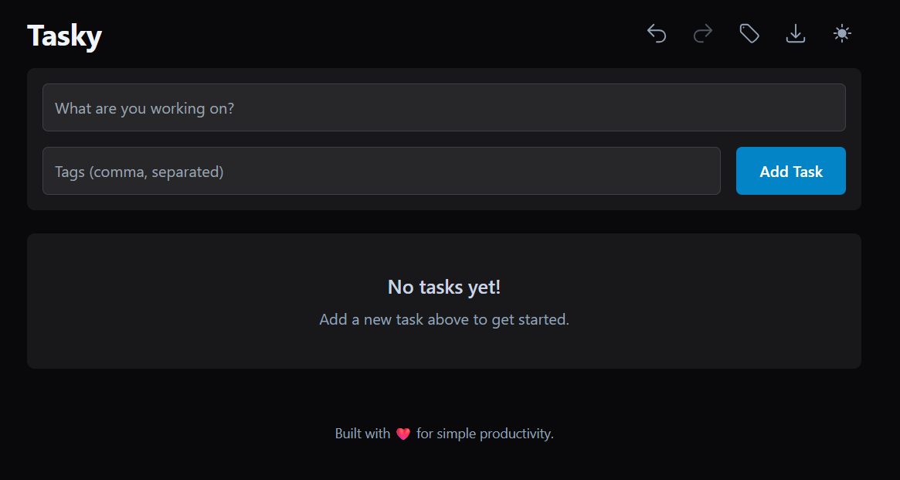

# Tasky - A Simple, Offline-First Task & Time Tracker
[](https://danial-razi.github.io/tasky)
[](https://react.dev/)
[](https://www.typescriptlang.org/)
[](https://tailwindcss.com/)
[](LICENSE)

Tasky is a modern, lightweight, and offline-first Progressive Web App (PWA) for task and time management. Designed for simplicity and efficiency, it helps you create, manage, and track your daily tasks directly in your browser. With no server required, all your data is stored locally, ensuring privacy and blazing-fast performance, even without an internet connection.

[→ Launch Tasky PWA](https://danial-razi.github.io/tasky)



---

## ✨ Key Features

- **📝 Full Task Management**: Create, edit, delete, and mark tasks as complete with a minimal and intuitive user interface.
- **⏱️ Integrated Time Tracking**: Each task has a built-in timer with start, pause, and stop/reset functionality.
- **🏷️ Flexible Tagging System**: Organize tasks with comma-separated tags. Tags can be managed globally (renamed or deleted) from a central Tag Manager.
- **🚀 Offline-First PWA**: All data is stored locally, making the app fully functional without an internet connection. Install it on your desktop or mobile device for a native, app-like experience.
- **🔍 Powerful Filtering & Search**:
    - Instantly search tasks by title or tag.
    - Filter tasks by status (Pending, In Progress, Paused).
    - Filter tasks by a specific tag.
- **🔃 Advanced Sorting**: Sort your task list by creation date (newest/oldest) or alphabetically by title (A-Z/Z-A).
- **↩️ Undo/Redo**: Never lose a change. Easily undo or redo actions like adding, editing, completing, or deleting tasks.
- **🎨 Dark & Light Mode**: A sleek theme toggle for comfortable viewing in any lighting condition, with your preference saved locally.
- **📤 Data Export**: Export all your tasks to JSON or CSV format for reporting or backup purposes.
- **📱 Responsive Design**: A clean, modern UI that works seamlessly on devices of all sizes.

---

## 🛠️ Technology Stack

- **Frontend**: [React](https://react.dev/) (using Hooks) & [TypeScript](https://www.typescriptlang.org/)
- **Styling**: [Tailwind CSS](https://tailwindcss.com/) for a utility-first styling workflow.
- **State Management**: Custom React Hooks for managing tasks, theme, and undo/redo state.
- **Data Storage**: Browser `localStorage` for a local-first, serverless architecture.
- **Offline Caching**: Service Worker API for PWA functionality.
- **Icons**: A custom set of SVG icons for a consistent look and feel.

---

## 🚀 Getting Started

### Install Tasky as a PWA (recommended)

1. Visit the hosted app at [https://danial-razi.github.io/tasky](https://danial-razi.github.io/tasky).
2. **Desktop (Chrome / Edge / Brave)**: Click the install icon in the address bar (monitor + down arrow) and confirm the prompt.
3. **Android (Chrome)**: Open the browser menu → *Install app* (or *Add to Home screen*).
4. **iOS (Safari)**: Tap the share icon → *Add to Home Screen*.

Tasky will live in its own window with offline support, native-like shortcuts, and persistent data.

### Run Tasky locally (development)

If you plan to work on the codebase, start the Vite dev server instead:

```bash
npm install
npm run dev
```

Open the printed local URL (default http://localhost:5173) to access the app with hot reload and full developer tooling.

---


## 📂 Project Structure

The project is organized into a clear and maintainable structure:

```
/
├── components/         # Reusable React components
│   ├── AddTaskForm.tsx
│   ├── BulkActionBar.tsx
│   ├── ControlBar.tsx
│   ├── FilterControls.tsx
│   ├── Header.tsx
│   ├── Icons.tsx
│   ├── SortMenu.tsx
│   ├── Tag.tsx
│   ├── TagManager.tsx
│   ├── TaskItem.tsx
│   ├── TaskList.tsx
│   └── Timer.tsx
├── hooks/              # Custom hooks for stateful logic
├── utils/              # Utility functions (time formatting, data export)
├── App.tsx             # Main application component
├── index.tsx           # Application entry point
├── types.ts            # Shared TypeScript type definitions
├── index.html          # Main HTML file
├── manifest.json       # PWA manifest
├── service-worker.ts   # PWA service worker logic
└── README.md           # You are here!
```

---

## 📄 License

This project is licensed under the MIT License.
